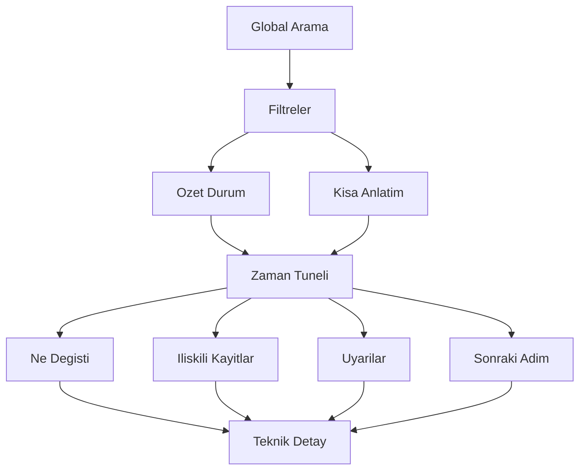

# Is Emri Merkezi Teknik Spec

Tarih: 20 Nisan 2026
Durum: Uygulamaya Hazir Taslak
Hedef Surum: V1

## 1. Ozet

Bu belge, mevcut `Is Emri Gecmisi` ekraninin yerine gecmesi planlanan `Is Emri Merkezi` modulu icin teknik ve urunsel gereksinimleri tanimlar.

Mevcut durum:

- Ekran sadece `tbIsEmriGecmisi` tablosundaki sinirli kayitlari listeler.
- Manuel is emri, GIED, stoktan dus, planlama ve personel aksiyonlarinin tamami bu ekranda gorunmez.
- "Kim yapti, nereden yapti, ne oldu, simdi ne durumda, sonra ne olacak" sorulari tek yerden cevaplanamaz.

Yeni hedef:

- Is emri ile ilgili tum kritik hareketleri olay bazli toplamak.
- Her kayit icin insan dilinde aciklanabilir bir zaman tuneli sunmak.
- Bir siparis veya gorevin tum hikayesini tek ekranda gostermek.
- Teknik kullanici ile operasyon kullanicisini ayni ekranda bulusturmak.

## 2. Problem Tanimi

Su anki ekran:

- Audit log gibi gorunuyor ama gercekte kismi bir log.
- Teknik kolonlar gosteriyor ama is akislarinin hikayesini anlatmiyor.
- "Stok Karsilandi" gibi kartlari var ama her akista log yazilmadigi icin sayaclar eksik kalabiliyor.
- Buyuk veri setinde pagination ve indeks eksikligi nedeniyle olceklendirilmesi zor.
- Kullaniciya "bir sonraki beklenen adim" bilgisini vermiyor.

Sonuc:

- Operasyon ekibi farkli ekranlar arasinda dolasiyor.
- Bir kaydin neden bu durumda oldugu hizli anlasilmiyor.
- Duzeltme, destek ve denetim surecleri yavasliyor.

## 3. Uygulama Hedefleri

### 3.1 Ana Hedefler

1. Her is emri veya siparis icin butun hareketleri tek yerde gostermek.
2. Hareketleri insan dilinde anlatmak.
3. Kim, ne zaman, nereden, neden ve ne degisti sorularina cevap vermek.
4. Su anki durumu ve bir sonraki beklenen adimi gostermek.
5. Tutarsizliklari otomatik isaretlemek.

### 3.2 Basari Kriterleri

1. Bir siparisin tum hikayesi 20 saniye icinde okunabilir olmali.
2. Kullanici baska ekrana gitmeden kaydin neden bu durumda oldugunu anlayabilmeli.
3. Tum kritik aksiyonlar `work_order_events` tablosuna dusmeli.
4. UI hem operasyon hem yonetici hem destek ekibine hitap etmeli.
5. Buyuk veri setinde arama ve filtreleme kabul edilebilir hizda calismali.

### 3.3 Hedef Disi Konular

- V1 kapsaminda tam yetki yonetimi redesigni yok.
- V1 kapsaminda mobil native uygulama yok.
- V1 kapsaminda ileri duzey BI dashboard yok.
- V1 kapsaminda tum eski verinin kusursuz normalize edilmesi garanti edilmeyecek.

## 4. Kullanim Senaryolari

### 4.1 Operasyon Kullanici Senaryolari

- Bu siparise ne zaman is emri verildi?
- Bu is emrini kim olusturdu?
- Is emri Siparis Yonetimi ekranindan mi verildi, manuel mi acildi, otomatik mi olustu?
- Siparis neden `UretimdenKarsilaniyor` durumunda?
- Bu siparis GIED'e bagli mi?
- Bu kayit stoktan mi karsilandi yoksa uretimden mi?
- Personel bu kayit icin uretim girisi yapti mi?

### 4.2 Destek ve Denetim Senaryolari

- Bu kaydin son 10 hareketini gormek.
- Durum once neydi, sonra ne oldu?
- Hangi kullanici hangi aksiyonu tetikledi?
- Bu kayit neden tutarsiz?
- Log eksikligi var mi?
- Sistem otomatik mi degistirdi yoksa kullanici mi?

### 4.3 Yonetici Senaryolari

- Hangi ekranlardan en cok is emri veriliyor?
- Hangi kullanicilar en cok iptal yapiyor?
- Hangi akislarda durum tutarsizliklari olusuyor?
- Personel paneli ve planlama aksiyonlari sistemde nasil akis yaratiyor?

## 5. Bilgi Mimarisi

V1 arayuzu asagidaki bloklardan olusacak:

1. Global arama alani
2. Hemen filtreler
3. Ozet durum paneli
4. Kisa anlatim karti
5. Zaman tuneli
6. Ne degisti paneli
7. Iliskili kayitlar paneli
8. Uyarilar ve anomaliler paneli
9. Sonraki adim paneli
10. Teknik detay paneli

### 5.1 Varsayilan Ekran Yapisi



### 5.2 Arama Deneyimi

Tek arama kutusu su tipleri desteklemeli:

- Siparis no
- Siparis satir no
- Gorev no
- Urun adi
- Sistem urun adi
- Musteri adi
- Personel adi
- Ozel uretim siparis no

## 6. Veri Modeli

### 6.1 Yeni Tablolar

#### `work_order_events`

Her kritik is akis hareketi tek satir event olarak kaydedilir.

Kolonlar:

| Kolon | Tip | Aciklama |
|---|---|---|
| `id` | bigint pk | Ic anahtar |
| `event_uuid` | uuid unique | Event tekilligi |
| `correlation_id` | uuid index | Ayni kullanici aksiyonundan dogan birden cok event'i baglar |
| `aggregate_type` | string(50) | `order_item`, `work_order`, `special_production`, `personnel_task` |
| `aggregate_id` | bigint | Ana varlik ID'si |
| `order_item_no` | bigint nullable index | `tbSiparisSatir.No` |
| `order_no` | string(50) nullable index | `tbSiparisSatir.SiparisNo` |
| `work_order_no` | bigint nullable index | `tbGorevler.No` veya legacy gorev numarasi |
| `pool_no` | bigint nullable | `tbBolumHavuz.No` |
| `personnel_task_no` | bigint nullable | `tbPersonelGorev.No` |
| `special_production_no` | bigint nullable | Ozel uretim siparis satiri |
| `event_type` | string(100) index | Makine okunur olay tipi |
| `event_group` | string(50) index | `create`, `cancel`, `stock`, `planning`, `production`, `system` |
| `source_screen` | string(100) | Aksiyonun geldigi ekran |
| `source_action` | string(100) | Kullanici aksiyonu |
| `source_route` | string(200) nullable | HTTP route veya command sinifi |
| `actor_type` | string(30) | `admin`, `personnel`, `system`, `command` |
| `actor_id` | string(50) nullable | User veya Personel ID |
| `actor_name` | string(150) nullable | Gosterim icin ad |
| `actor_department` | string(150) nullable | Bolum |
| `status_before` | string(50) nullable | Onceki durum |
| `status_after` | string(50) nullable | Sonraki durum |
| `title_human` | string(255) | Kisa baslik |
| `summary_human` | text | Insan dilinde anlatim |
| `next_step_human` | text nullable | Beklenen sonraki adim |
| `payload_before` | json nullable | Onceki snapshot parcasi |
| `payload_after` | json nullable | Sonraki snapshot parcasi |
| `context` | json nullable | Ek baglam |
| `happened_at` | datetime index | Olay zamani |
| `created_at` | datetime | Laravel timestamp |
| `updated_at` | datetime | Laravel timestamp |

Onerilen indexler:

- `unique(event_uuid)`
- `index(correlation_id)`
- `index(order_item_no, happened_at)`
- `index(work_order_no, happened_at)`
- `index(event_type, happened_at)`
- `index(actor_id, happened_at)`
- `index(status_after, happened_at)`

#### `work_order_snapshots`

Her ana varlik icin son durum ozeti.

| Kolon | Tip | Aciklama |
|---|---|---|
| `id` | bigint pk | Ic anahtar |
| `aggregate_type` | string(50) | Ana varlik tipi |
| `aggregate_id` | bigint | Ana varlik no |
| `order_item_no` | bigint nullable | Siparis satir no |
| `order_no` | string(50) nullable | Siparis no |
| `work_order_no` | bigint nullable | Koku gorev no |
| `current_status` | string(50) nullable | Guncel durum |
| `current_stage` | string(50) nullable | `waiting`, `issued`, `in_pool`, `in_production`, `fulfilled_from_stock`, `cancelled` |
| `current_holder_type` | string(50) nullable | `department`, `personnel`, `stock`, `special_production`, `system` |
| `current_holder_id` | string(50) nullable | Holder id |
| `current_holder_name` | string(150) nullable | Holder adi |
| `linked_special_production_no` | bigint nullable | GIED linki |
| `next_expected_action` | string(255) nullable | Sonraki beklenen adim |
| `last_event_id` | bigint nullable | Son event |
| `last_changed_at` | datetime nullable | Son degisim |
| `alert_count` | integer default 0 | Acik anomaly sayisi |
| `snapshot` | json nullable | Hesaplanmis zengin snapshot |
| `created_at` | datetime | Timestamp |
| `updated_at` | datetime | Timestamp |

Unique key:

- `unique(aggregate_type, aggregate_id)`

### 6.2 Legacy ile Iliski

- `tbIsEmriGecmisi` kaldirilmaz.
- `tbIsEmriGecmisi` yalnizca eski veri kaynagi ve backfill kaynagi olarak kullanilir.
- V1 UI'da ana veri kaynagi `work_order_events` olur.

## 7. Event Sozlugu

V1 minimum event tipleri:

| Event Type | Event Group | Kaynak |
|---|---|---|
| `order_imported` | `order` | Siparis yukleme |
| `product_matched` | `match` | Eslesme |
| `product_match_changed` | `match` | Manuel degisim |
| `work_order_created_single` | `create` | Siparis Yonetimi |
| `work_order_created_bulk` | `create` | Toplu is emri |
| `work_order_created_manual` | `create` | Tekli is emri |
| `work_order_created_auto_threshold` | `create` | Kritik stok |
| `work_order_cancelled` | `cancel` | Siparis Yonetimi |
| `order_passivated` | `status` | Pasife alma |
| `order_reactivated` | `status` | Tekrar aktif etme |
| `wip_linked` | `wip` | GIED baglama |
| `wip_unlinked` | `wip` | GIED iptal |
| `stock_deducted` | `stock` | Stoktan dus |
| `personnel_task_taken` | `production` | Personel paneli |
| `production_completed_partial` | `production` | Uretim girisi |
| `production_completed_full` | `production` | Uretim tamamlama |
| `personnel_task_deleted` | `production` | Gorev silme |
| `planning_incremented` | `planning` | Planlama + |
| `planning_decremented` | `planning` | Planlama - |
| `planning_rescheduled` | `planning` | Tarih tasima |
| `status_corrected_by_system` | `system` | Otomatik duzeltme |

## 8. Actor ve Kaynak Standardi

### 8.1 Actor Cozumleme

Mevcut sistem `Auth::user()` tarafinda fiilen `Personnel` modeli ile calisiyor. Bu nedenle actor cozumleme su sirayla yapilacak:

1. `Auth::check()` false ise `actor_type=system`
2. `Auth::user()->isAdmin()` true ise `actor_type=admin`
3. Aksi halde `actor_type=personnel`

Kaydedilecek alanlar:

- `actor_id`
- `actor_name`
- `actor_department`
- `actor_type`

### 8.2 Source Screen Standardi

Kaynak ekranlar controlled vocabulary ile tutulacak:

- `Siparis Yonetimi`
- `Tekli Is Emri`
- `Toplu Is Emri`
- `Is Emri Merkezi`
- `Personel Paneli`
- `Uretim Planlama`
- `Kritik Stok`
- `Admin Database`
- `Sistem Komutu`
- `Veri Duzeltme`

Kaynak aksiyon ornekleri:

- `Is Emri Ver`
- `Toplu Is Emri Ver`
- `Manuel Is Emri Ver`
- `Is Emri Iptal`
- `Pasife Al`
- `Yeniden Aktif Et`
- `GIED Bagla`
- `GIED Iptal`
- `Stoktan Dus`
- `Gorev Al`
- `Uretim Gir`
- `Gorev Sil`
- `Planlama +1`
- `Planlama -1`
- `Tarih Tasindi`

## 9. Snapshot Mantigi

`WorkOrderSnapshotProjector` her event sonrasi varligin guncel ozetini yeniden hesaplar.

### 9.1 Current Stage Hesaplama

Kurallar:

- `UretimBekliyor` ve `GorevNo` bos => `waiting`
- `IsEmriVerildi` => `issued`
- Havuz kaydi var => `in_pool`
- Personel gorevi var => `in_production`
- `UretimdenKarsilaniyor` ve `BagliOlduguOzelUretimNo` dolu => `linked_to_special_production`
- `StokKarsilandi` => `fulfilled_from_stock`
- `Pasif` => `cancelled`
- `PasifDevamEden` => `cancelled_but_processing_tail`

### 9.2 Next Expected Action Hesaplama

Ornek kural seti:

- `waiting` + yeterli stok => `Stoktan karsilanabilir`
- `waiting` + uygun GIED => `Uygun ozel uretime baglanabilir`
- `waiting` + stok yetersiz => `Is emri verilmesi bekleniyor`
- `issued` + havuz kaydi var => `Personele aktarim bekleniyor`
- `in_production` => `Uretim girisi bekleniyor`
- `linked_to_special_production` => `Bagli ozel uretimin tamamlanmasi bekleniyor`
- `fulfilled_from_stock` => `Siparis kapanis kontrolu yapilmali`

## 10. Narration Service

`WorkOrderNarrationService` her event icin okunabilir metin uretir.

### 10.1 Human Summary Kurallari

Event icin asagidaki format kullanilir:

`{happened_at} tarihinde {actor_name}, {source_screen} ekranindan {title_human}. Once: {status_before}. Sonra: {status_after}.`

Ornekler:

- `20 Nisan 2026 14:32 tarihinde Cuma Yildirim, Siparis Yonetimi ekranindan bu siparise is emri verdi. Once: UretimBekliyor. Sonra: IsEmriVerildi.`
- `20 Nisan 2026 15:10 tarihinde Sistem, bu siparisi stoktan karsiladi. Once: UretimdenKarsilaniyor. Sonra: StokKarsilandi.`

### 10.2 Cocuk Dostu Duz Anlatim

Secili kayit icin ust panelde daha da sade bir anlatim verilecek:

- `Bu siparis icin once is emri acildi.`
- `Sonra uretim takibi basladi.`
- `Su anda bu kayit stoktan karsilanmis durumda.`
- `Bu kayit icin su an yeni bir isleme gerek yok.`

## 11. UI Teknik Spec

### 11.1 Ana Sayfa Bilesenleri

1. `SearchHero`
2. `QuickFilters`
3. `CurrentStatusPanel`
4. `NarrationPanel`
5. `TimelineList`
6. `DiffPanel`
7. `RelatedEntitiesPanel`
8. `AlertsPanel`
9. `NextStepPanel`
10. `TechnicalDetailsDrawer`

### 11.2 Timeline Card Alani

Her kartta gorunecek alanlar:

- Icon
- Event basligi
- Human summary
- Zaman
- Actor
- Kaynak ekran
- Once ve sonra durum badge'leri
- "Detay ac" butonu

### 11.3 Teknik Detay Drawer

Alanlar:

- Event UUID
- Correlation ID
- Event type
- Route
- Actor raw id
- Iliskili tablo anahtarlari
- Before payload
- After payload
- Context JSON

### 11.4 Filtreler

V1 filtreleri:

- Tarih araligi
- Event type
- Event group
- Actor
- Source screen
- Current status
- Order no
- Work order no
- Special production no

## 12. API Spec

### 12.1 `GET /api/work-order-center/feed`

Amac:

- Genel feed listesi

Query:

- `q`
- `event_type`
- `event_group`
- `actor_id`
- `source_screen`
- `status`
- `date_from`
- `date_to`
- `page`
- `per_page`

Response:

```json
{
  "data": [],
  "meta": {
    "page": 1,
    "per_page": 25,
    "total": 120
  }
}
```

### 12.2 `GET /api/work-order-center/entity/{type}/{id}`

Amac:

- Secili varligin tek bakislik detay ozeti

Response:

```json
{
  "entity": {
    "type": "order_item",
    "id": 1532,
    "current_status": "IsEmriVerildi",
    "current_stage": "in_pool",
    "current_holder_name": "Dikim Bolumu",
    "next_expected_action": "Personele aktarim bekleniyor"
  },
  "narration": {
    "short": "Bu siparis icin is emri verildi ve su anda havuzda gorev bekliyor.",
    "long": "..."
  },
  "alerts": [],
  "related": {}
}
```

### 12.3 `GET /api/work-order-center/timeline`

Amac:

- Belirli order item veya work order timeline'i

Query:

- `order_item_no`
- `work_order_no`
- `correlation_id`

## 13. Backfill ve Gecis Stratejisi

### 13.1 Backfill Kaynaklari

- `tbIsEmriGecmisi`
- `tbSiparisSatir`
- `tbGorevler`
- `tbBolumHavuz`
- `tbPersonelGorev`

### 13.2 Komut

Yeni artisan komutu:

- `php artisan work-order-center:backfill`

Adimlar:

1. Legacy history tablosunu event'e cevir.
2. Event olmayan ama kritik durumdaki siparisleri tarayip sentetik event uret.
3. Snapshot projector ile tum snapshot'lari yeniden kur.
4. Backfill edilen event'lere `context.backfilled=true` ekle.

### 13.3 Backfill Kurallari

- Orijinal veri guvenilirse oldugu gibi al.
- Belirsiz actor varsa `actor_type=system`, `actor_name=Legacy Kayit`.
- Eksik route bilgisi varsa `source_screen=Legacy`, `source_action=Backfilled`.

## 14. Anomaly Detection

`WorkOrderAnomalyDetector` veya snapshot icinde kural seti kullanilacak.

V1 anomaly kurallari:

1. `IsEmriVerildi` ama `GorevNo` yok
2. `StokKarsilandi` ama `stock_deducted` eventi yok
3. `BagliOlduguOzelUretimNo` dolu ama durum uyumsuz
4. Siparis uretimde gorunuyor ama havuz ve personel gorevi yok
5. Ayni siparis icin birden fazla acik kok gorev var
6. Manuel is emri var ama siparis iliskisi yok
7. Event zaman sirasi geriye dusuyor

Alert alani:

- `code`
- `severity`
- `message`
- `suggested_fix`

## 15. Kodlama Mimarisi

### 15.1 Yeni Dosyalar

- `app/Services/WorkOrderEventLogger.php`
- `app/Services/WorkOrderSnapshotProjector.php`
- `app/Services/WorkOrderNarrationService.php`
- `app/Services/WorkOrderCenterQueryService.php`
- `app/Http/Controllers/WorkOrderCenterController.php`
- `resources/views/workorders/center.blade.php`
- `database/migrations/xxxx_xx_xx_create_work_order_events_table.php`
- `database/migrations/xxxx_xx_xx_create_work_order_snapshots_table.php`

### 15.2 Dokunulacak Mevcut Alanlar

- `app/Services/OrderToWorkOrderService.php`
- `app/Http/Controllers/SiparisApiController.php`
- `app/Http/Controllers/PersonnelPanelController.php`
- `app/Http/Controllers/ProductionPlanningController.php`
- `app/Http/Controllers/AdminDatabaseController.php`
- `routes/web.php`

## 16. Entegrasyon Haritasi

Asagidaki aksiyonlar event logger'a baglanacak:

### Siparis Yonetimi

- Siparisten is emri ver
- Toplu is emri ver
- Is emri iptal et
- Toplu iptal
- Pasife al
- GIED bagla
- GIED iptal
- Stoktan dus
- Eslestirme degistir
- Tekrar aktif et

### Tekli Is Emri

- Manuel is emri olustur

### Personel Paneli

- Gorev al
- Uretim girisi yap
- Gorev sil

### Uretim Planlama

- Gorev +1
- Gorev -1
- Gorev tarih tasima

### Sistem

- Ghost order duzeltme
- Kritik stok otomatik is emri
- Backfill

## 17. Test Spec

### 17.1 Unit Testler

- `WorkOrderEventLoggerTest`
- `WorkOrderSnapshotProjectorTest`
- `WorkOrderNarrationServiceTest`
- `WorkOrderAnomalyDetectorTest`

### 17.2 Feature Testler

- Is emri verildiginde event yazilir
- Manuel is emri event yazar
- GIED baglama event yazar
- Stoktan dus event yazar
- Personel gorev alma event yazar
- Planlama +1 event yazar
- Timeline API dogru siralar
- Feed pagination dogru calisir

### 17.3 Backfill Testleri

- Legacy history event'e cevrilir
- Eksik actor bilgisi default'a duser
- Snapshot yeniden kurulabilir

## 18. Performans ve Olceklenebilirlik

- Feed endpoint pagination ile calisacak.
- Varsayilan `per_page=25`.
- Timeline endpoint en fazla son 200 olay dondurecek, daha fazlasi "daha fazla yukle" ile acilacak.
- Buyuk JSON payload'lar normalize edilmeli.
- Index olmayan kolonlara agir filtre verilmemeli.

## 19. Guvenlik

- Tum yeni endpoint'ler `auth` altinda olacak.
- Yonetici odakli detay endpoint'ler `admin` middleware kullanacak.
- Teknik JSON detay sadece yetkili kullaniciya gosterilecek.
- Event payload icinde hassas veri tutulmayacak.

## 20. Rollout Plani

### Faz 1

- Migration'lar
- Event logger
- Is emri verme ve iptal event'leri
- Basit feed API

### Faz 2

- GIED ve stok event'leri
- Personel ve planlama event'leri
- Snapshot projector

### Faz 3

- Yeni UI
- Narration service
- Alerts paneli

### Faz 4

- Backfill
- Eski history ekranindan yonlendirme
- Export ve ek filtreler

## 21. Definition of Done

Bir event tipi "tamamlandi" sayilmasi icin:

1. Event logger entegrasyonu tamam
2. Snapshot etkisi tanimli
3. Human summary uretilebiliyor
4. Timeline'da gorunuyor
5. Feature test mevcut
6. Gerekirse anomaly kurali yazildi

## 22. Acik Kararlar

V1 baslangicinda urun sahibi tarafindan netlestirilmesi faydali kararlar:

1. Yeni ekran adi kesin olarak `Is Emri Merkezi` mi olacak?
2. Teknik detay drawer tum adminlere acik mi olacak?
3. Export V1'de gerekli mi yoksa Faz 4'e mi kalacak?
4. Event payload icin maksimum saklama boyutu ne olacak?

